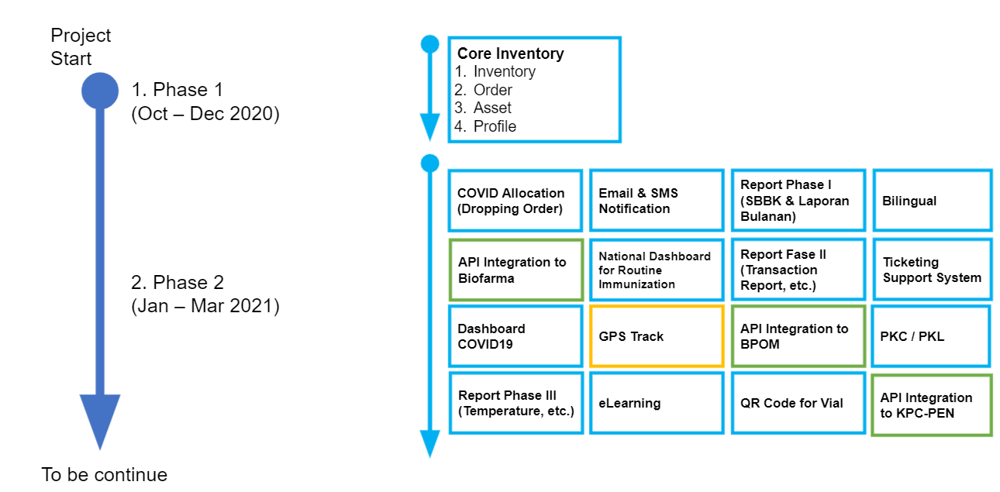
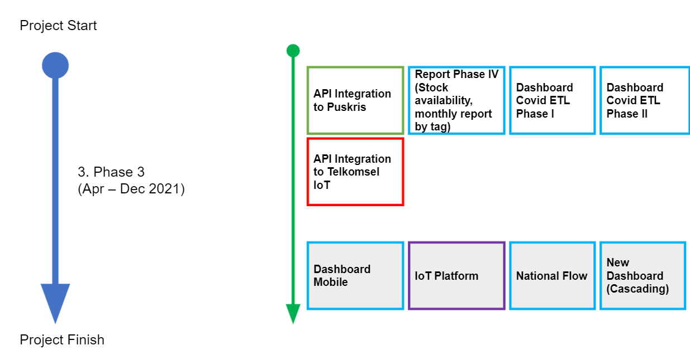
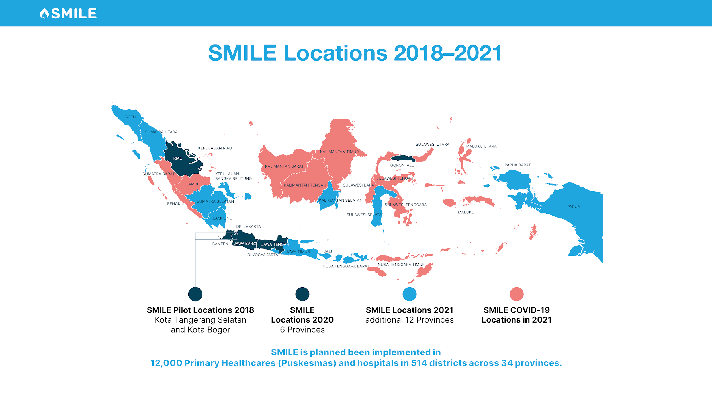
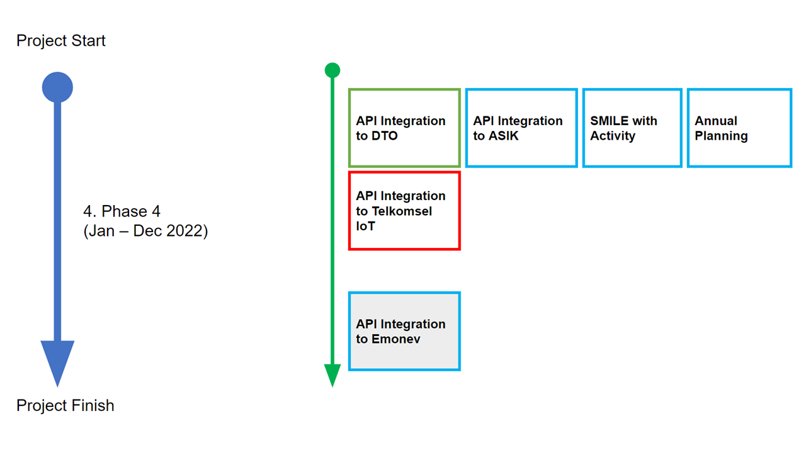

Development Roadmap
=====

**1st Phase**
-----

In the first phase, the objective of the application is to develop the core functionality on 4 main aspects: inventory; order; asset; and profile. The main output for the first phase is to develop a mobile application, website and IOT for the vaccine supply chain management system in Indonesia in 100 facilities with a new alternate temperature monitoring device.

**2nd Phase**
-----

In the second phase, the objective is to enhance the software on the COVID19 modules, integration with GPS location and temperature monitoring tracking, QR codes scanning for vaccine vial identifications, Online Learning website for supporting socialization and training, other advancement and API modules. Therefore, the system will increase the number of facilities, customizing features for COVID19 vaccine and logistics, interoperability between information systems (owned by Ministries, vaccine manufacturers/private sector, sub-national level, Pusdatin and Google Cloud as backup center) and Internet of Things (IoT) technology of GPS track and vial identification of vaccines (QR codes), and consequences of functions such as software maintenance, user trainings (online and offline), troubleshooting etc.

Output:
  - Software enhancement on customized reporting (web-based) to facilitate the generation and production of reports and graphical data presentation form database engine
  - Software enhancement to deploy alternate Remote Temperature Monitoring (RTM) devices that will transmit and record the temperature in gradually 600 and 3,000 facilities (from 100 facilities in original contract) in accordance with the Indonesian FDA regulation.
  - Software enhancement of mobile and web for COVID19 vaccine supply chain management system in all 12,000 Puskesmas and Public Hospitals (health facilities) as vaccination sites for Indonesian across the country (from zero facilities for COVID19 application features)
  - Develop and customized API for SMILE to be able to communicate with at least 7 (seven) national information system that has been assigned to monitor and report coverage and logistics of COVID19 immunization by the COVID-19 Response and National Economic Recovery Committee, namely: Peduli Lindungi (online registration for vaccine recipients), Trace and Track of Biofarma (logistic transportation from central to provincial level), P-Care (record the vaccine recipients),  and KPC-PEN dashboard (one-data platform), Pusdatin MoH (logistics non vaccines), Crisis Center of MoH (logistics non vaccines), National FDA (BPOM). 
  - Infrastructure provisioning with team in Data Center, the MoH
  - SMS Gateway provisioning and management
  - Bug fixing and Maintenance

**3rd Phase**
-----
In the third phase, the goals of the project is to enhance the system through software function leverage in terms of scalability (e.g. increasing number of facilities, additional modality for national flow), interoperability between information systems (owned by Ministries, vaccine manufacturers/private sector, sub-national level), Internet of Things (IoT) technology, and consequences of functions such as software maintenance, user trainings, troubleshooting etc.

Output:
  - Software enhancement on the national module of vaccine planning and/or forecasting (web-based) to facilitate the generation of accurate vaccine projections for better efficiencies.
  - Software enhancement for dashboard covid
  - Software enhancement on customized reporting (web-based) to facilitate the generation and production of reports and graphical data presentation form database engine
  - Software enhancement to deploy alternate Remote Temperature Monitoring (RTM) devices that will transmit and record the temperature in 600 facilities (from 100 facilities in original contract) in accordance with the Indonesian FDA regulation.

**4th Phase**
-----
The objective of this phase is to enhance the software on the inventory modules, disposal for waste management, integration with the Ministry of Health Republic Indonesia, and Annual Planning. Since SMILE has a huge database, the infrastructure is adding more servers becoming 5 servers for databases. Those servers have specific services to handle like OLTP, cron Job, OLAP, etc. Besides that, other application owned by the ministry of health wants to collect data from SMILE because SMILE has comprehensive data on inventory, and the Integration API is developed to overcome those challenges.

Output:
- Enhancement in inventory modules by adding activity in transaction and order menu. This activity eases the user to record material based on the actual transaction in the health facility.
- The disposal menu aims to record the supply chain in waste management. Several waste material can not be disposed of by the facility itself, it needs to be distributed to other facilities like District Health Office and Provincial Health Office. The disposal Menu tracks waste material whether disposed of by facility or distributed to other facilities.
- Develop and customized API for integration with the ministry of health. The ministry of health such as DTO, ASIK, and E-Monev will get data from API SMILE.
- Enhancement in Annual Planning by adding an approval process from the district office of Health (DOH) to the provincial office of health (POH). POH will review the annual planning first before it is approved and collected by the ministry of health.

