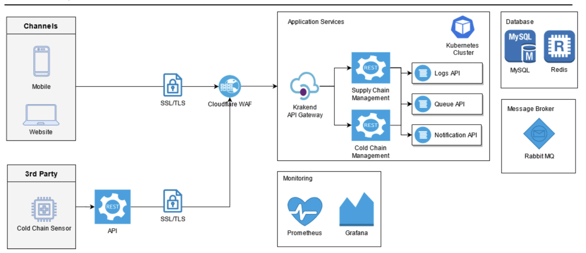
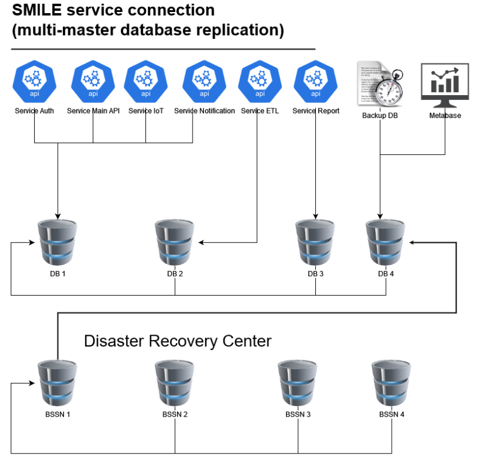
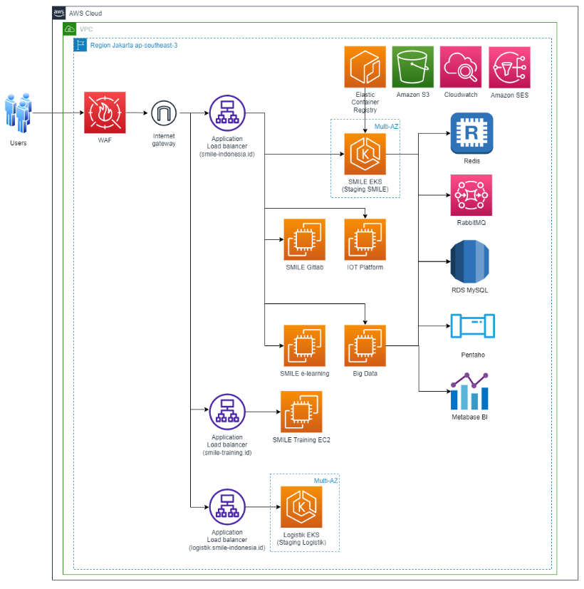
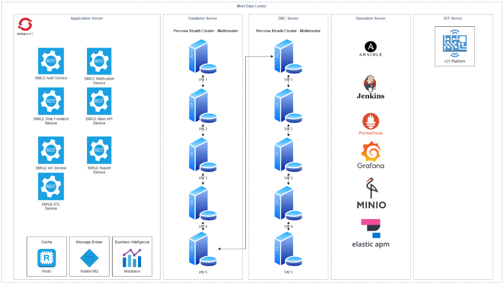

System Architecture
=====

System architecture describes how each component of the applications interact within the  underlying system. This diagram details every service used and what technology developed under them.

Mobile Application
----- 
Application for the end user (medical facility / puskesmas) can monitor and manage the stock  management on their facility. 

 Technology 
 Front-end React Native 

Website Application
-----
Application for the head role (dinkes) of end users (medical facility / puskesmas) to monitor and  distribute the supply chain of the inventory to medical facilities. 

 Technology 
 Front-end React.js 
 Framework Next.js 

SSL / TLS
----- 
The communication between the front-end application with the backend application is encrypted  through Secure Socket Layer (SSL) with HTTPS protocol. 

Cloudflare WAF (Web Application Firewall)
-----
The data sent to the backend application is filtered by cloudflare WAF for protection against DDos  or other unauthorized attacks.

Kubernetes Cluster 
-----
Kubernetes is used for container orchestration for every service used in the applications.

Supply Chain Management (API) 
-----
Supply Chain Management API handles the process which includes but not limited to transactions  in every medical facility, handling requests from mobile and website applications. 

   Technology 
   Back-end Node.js 
   Framework Express.js 

Cold Chain Management (API) 
-----
Cold Chain Management API handles the process of requests from cold chain sensors through  the API or other channels 

   Technology 
   Back-end Node.js
   Framework Express.js 

Logs (API) 
-----
Logs API is a service which handles every log needed by the system including but not limited to:  system error log, debug log, informational log, etc. 

   Technology 
   Back-end Node.js 
   Framework Express.js 

Queue (API) 
-----
Queue API is a service which handles queuing for system needs, including but not limited to:  processing the requests from the cold chain, handling the queuing for notifications, etc.  

   Technology 
   Back-end Node.js 
   Framework Express.js 
   Messaging Rabbit MQ 

Notification (API) 
-----
Notification API is a service which handles notifications for every user, used for alarming the  expected user about the inventory and cold chain sensors. 

   Technology 
   Back-end Node.js 
   Framework Express.js

MySQL (Database) 
-----
MySQL is used for databases as its capability to handle many transactions, and is good at  OLAP/OLTP systems which have proof for its read speed capability. 

   Technology 
   Database MySQL 

Redis (Cache) 
-----
Redis is used for backend caching to fetch the data faster than querying a database. 

   Technology 
   Database Redis 

Rabbit MQ (Message Queuing) 
-----
Rabbit MQ is used for queuing messages used by queue service. 

   Technology 
   Message Broker Rabbit MQ 

Prometheus 
-----
Prometheus is used to gather data from the underlying operating system. It can be used to get the data to monitor the usage of the server. 

Grafana 
-----
Grafana is used as a dashboard to monitor the usage of the server, which the data is supplied by prometheus.

Infrastructure
=====
There are two managed infrastructure of SMILE application: Staging environment and Production environment. In Addition, production infrastructure is append to Disaster Recovery System.

Disaster Recovery System  
-----

  
Staging 
-----

Staging Infrastructure is managed in AWS services using EKS (Elastic Kubernetes Services) as the container orchestration which configured to handle large scale of requests using auto-scalable pattern horizontally and  vertically.
The database is configured on the managed service AWS RDS MySQL 8.0.

Production 
-----

  
Production Infrastructure is on premise server in Ministry of Health Data Center. Consist of 5 nodes of Openshift, and 5 nodes of VM databases configured with multi-master percona xtradb cluster.
