Main Features
=====

**1.	Inventory Management**
-----
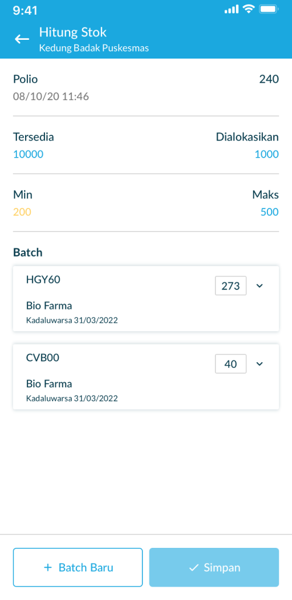
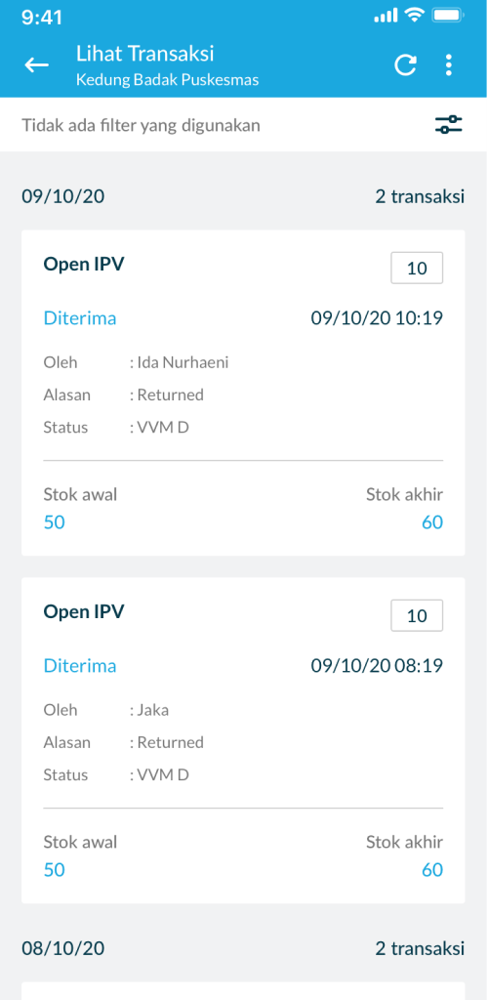
   
The objective of the inventory feature is to display the information of entity stock and all transactions (batch, material status, transaction date) in every entity group from District to Sub-District Puskesmas. In this feature, health officers can update manually the number of each vaccine. 
   
This inventory feature consist of several functionality including:

- View the list of Sub District Puskesmas
- Displays the Puskesmas  entity stock information.  Districts and Puskesmas entity groups throughout  the Districts on each inventory transaction- Seeing the stock by  leveling entity groups of  Puskesmas from District  to Sub-District
- Conduct a "local transfer"  of stock from the Puskesmas. District to  Sub-District Puskesmas  through the "Enter Stock Amount" feature
- Logical adjustment of  inventory data on an entity (sub-district health  center / sub-district health center) and an entity  group (accumulated  health center in the sub district)
- Perform filter / search On all features in the  inventory (See Stock, Enter Amount of Stock,  Input Expenses) when  selecting Vaccines
- View summary chart of all statuses:
   -	Display status percentage (normal, max, min  and out of stock) 
   -	Total items from many entities 
   -	Total items in each status 
   -	Clickable to change the list 
   -	Affected by inventory filters
-	View a list of  entities according  to their region affected by inventory filter and material  status
-	View the list of  provinces, affected by inventory filter and material status (Only accessible by national level users)
-	View the list of  districts/cities, affected by inventory filter and material  status (Only accessible by national and provincial  level users)
-	View entity details
   -	The name of the entity and the provinces
   -	List material on the entity with the amount of  stock and the last date of the material transaction 
   -	Total items
- View stock detail:
   -	Overview: Material name, entity name,  province-city, Material Tag 
   -	Stock on hand: date, amount of stock  remaining in entity , bar chart of its min-max  and stock point, amount allocated & amount shipped
-	View of list material:
   -	Status percentage 
   -	Material name 
   -	Total entities according to the status of the  total of all entities in the current region 
   -	Affected by inventory filter and material  status
-	Click material: 
   -	Material name 
   -	Total entities 
   -	View the list of entities with the amount of  stock according to the material in the entity.  Entity list according to the current region 
   -	The last date of the material transaction

**2.	Order Management**
-----
**a.  COVID19**

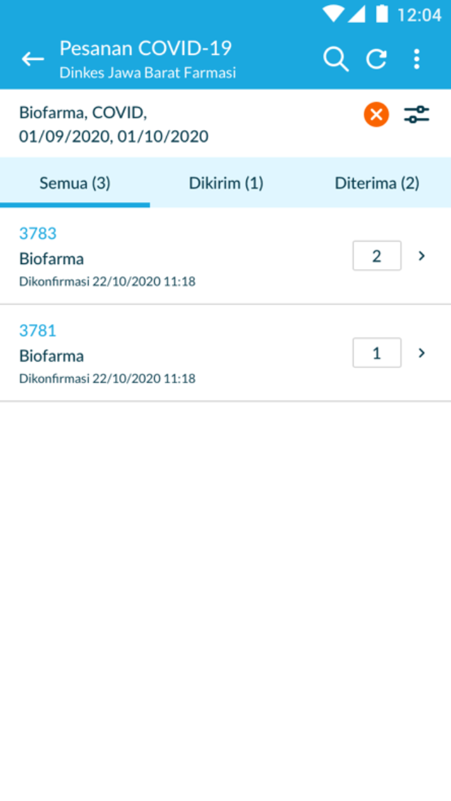
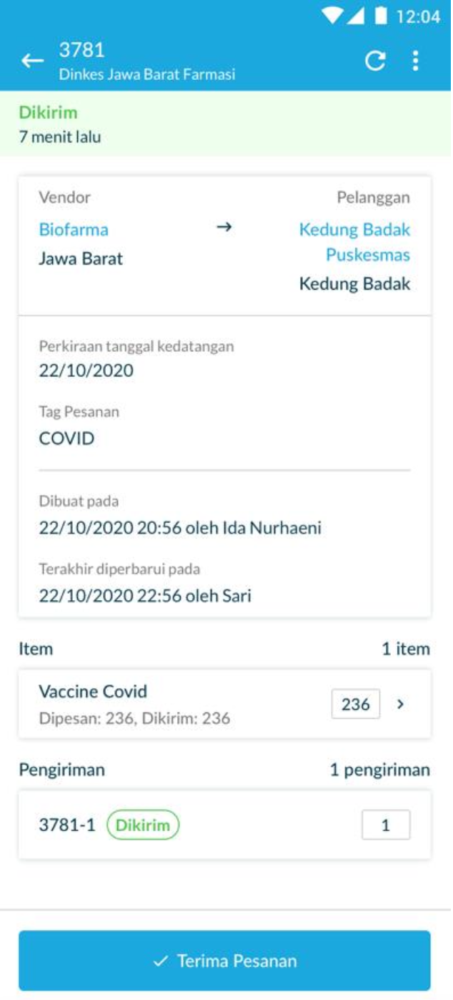
   
**b.  Routine Immunization**

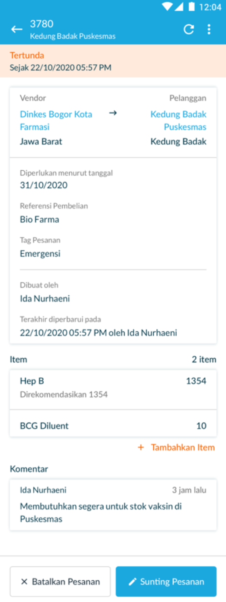
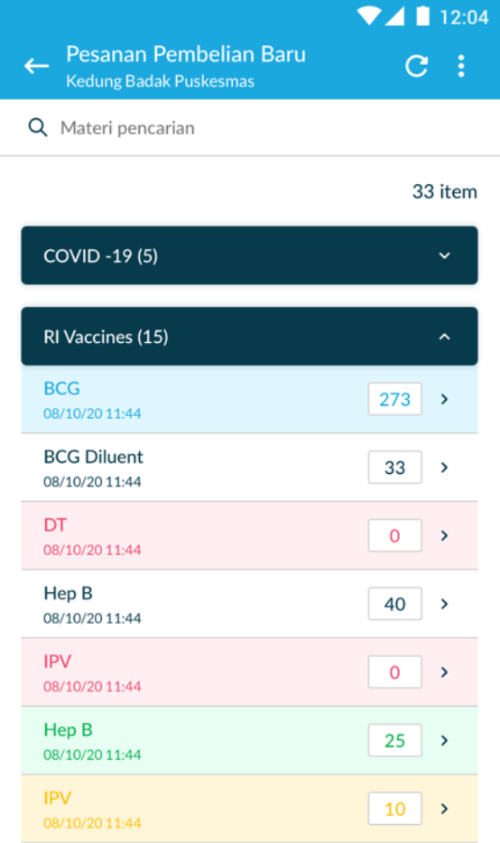

The order management feature for both routine vaccines and Covid19 vaccines displays all transactions made in the order process. In this case, health workers place orders and receive orders (for purchase) of vaccines. Users can also track the ordering process, for example when there is a mismatch in the quantity along with the reason. Health workers can make orders with the optimal number of orders according to system recommendations. Order management also functions as an update of the amount of stock in a facility if there is a change when there is an order and stock delivery. In this feature, we can see the number of vaccines sent and received. Monitor the process of purchasing vaccines, purchase history to export order data.
   
Some of the main features of Order and fulfillment management:
-	Purchase order
-	Sales order
-	Export order data
-	Order shipment tracking
-	Order tracking history
-	QR code for VIAL
   
**c.  Temperature Logger Monitoring**

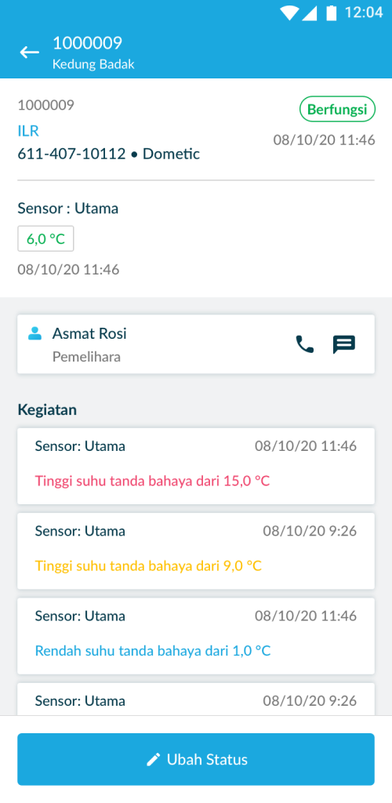
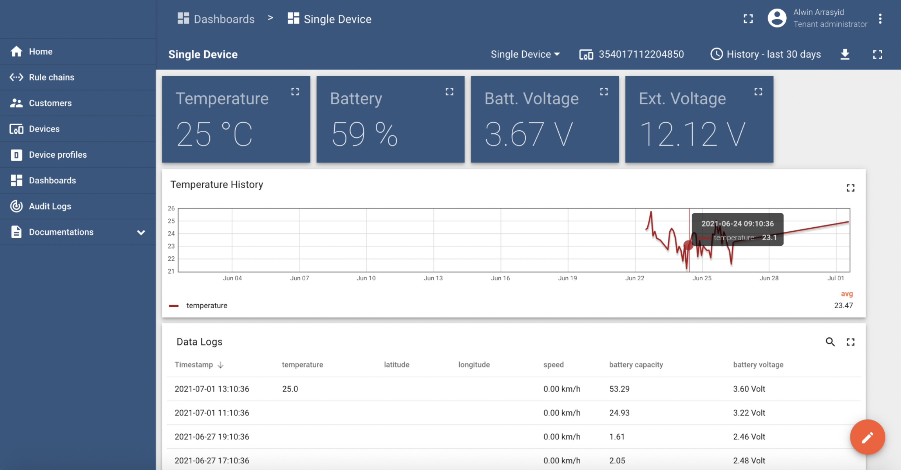

Temperature Logger monitors the temperature in the refrigerator in real-time and sees how the condition of the refrigerator, battery capacity, battery voltage, and views temperature history for a certain period. Health officers periodically check temperature compliance and asset status. Through this function, health officers can monitor whether the refrigerator is functioning properly and does not experience problems such as power failures, malfunctions, etc. This feature monitors the temperature 24 hours a day and the sensor inside the refrigerator transmits signals every 10 minutes to the application.

When a problem occurs, the system will automatically give an alarm via SMS to the Puskesmas staff to take protective actions against the vaccine, such as resetting the refrigerator thermostat, or moving the vaccine to a cool box, or temporary refrigerator until the refrigerator temperature returns to normal.

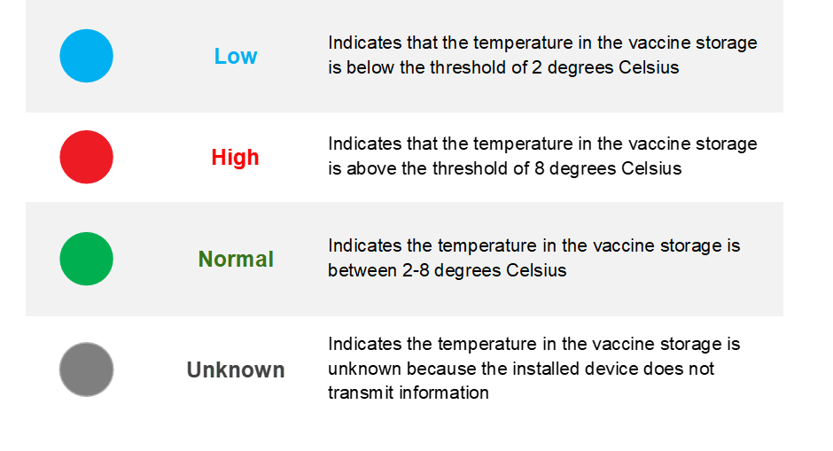

**3. Dashboard**
-----
**a. COVID19**

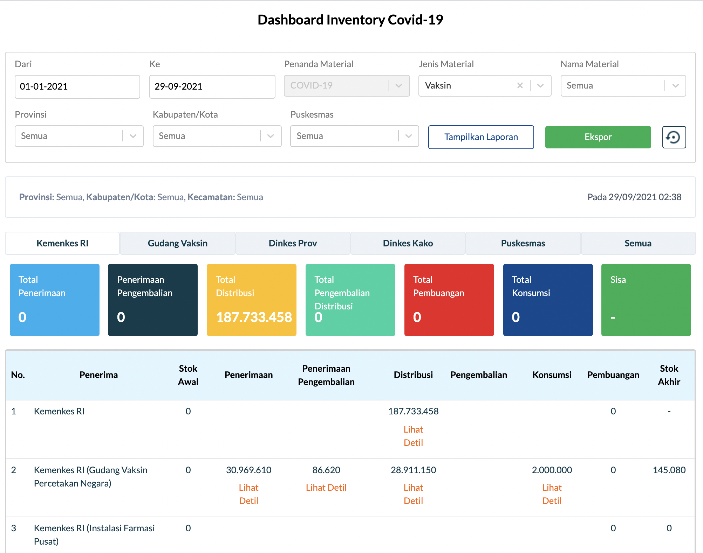
      
We may examine detailed statistical data on the total distribution of Covid-19 vaccinations in the Covid-19 Inventory Dashboard. The data shown is real-time data from the Indonesian Ministry of Health, vaccination warehouses, Provincial Health Offices, City District Health Offices, and Community Health Centers.

Total receipts, returns, distributions, distribution returns, total disposals, total consumption, and remaining vaccine supply are all displayed on this dashboard. There is a filter option that allows us to search by time, material tag, material type, material name, province name, city district, and health facility. Reports displayed in this dashboard can be exported to make it easier for users to analyze the data.
   
**b. Routine Immunization**
      
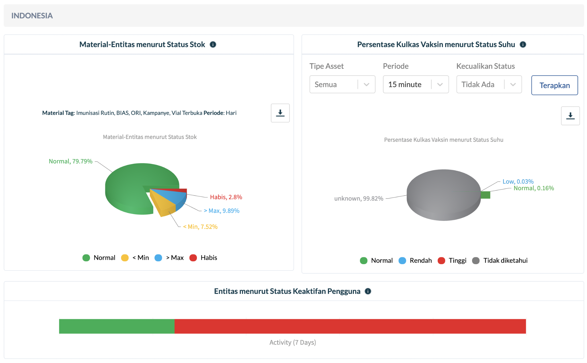
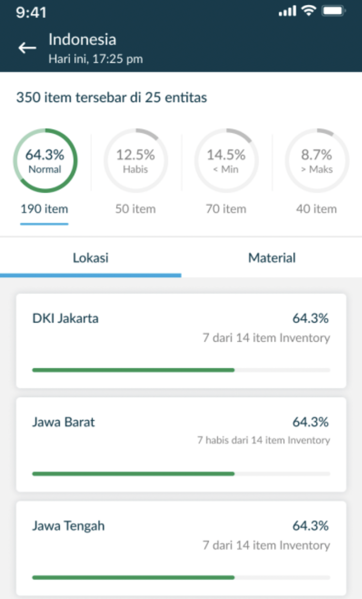
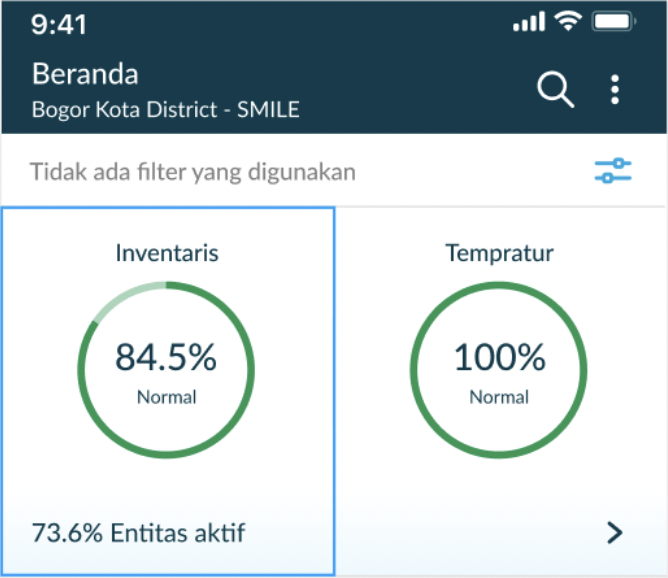
      
All data displayed in the Covid dashboard is also contained in the routine dashboard. The difference is that the routine dashboard displays other routine vaccines such as BCG, polio, diphtheria, and so on. This routine vaccination dashboard also shows overview data such as refrigerator temperature for vaccine storage, stock activity, leveling entity, and other information. 

**4. Report**
-----

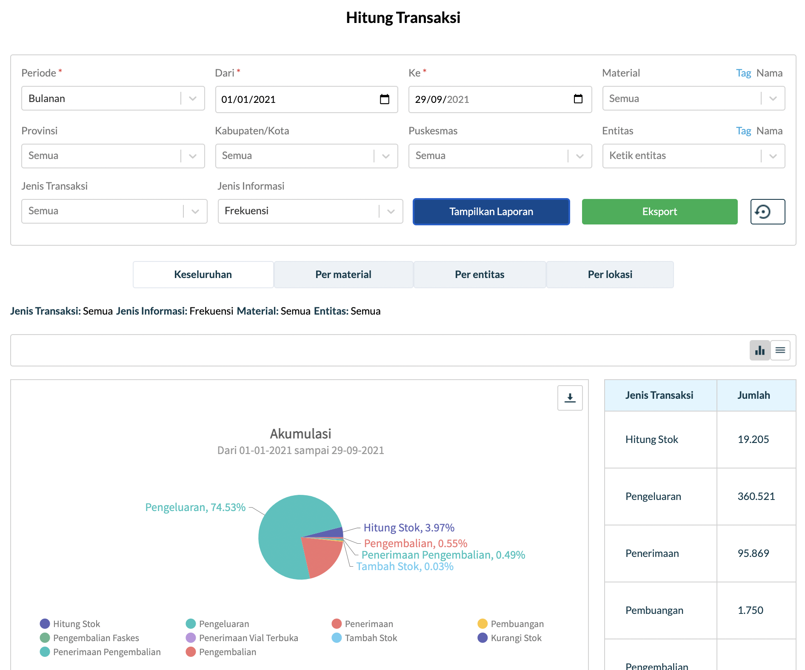

The SMILE dashboard can display comprehensive reports on all types of vaccine transactions with category-based filter options, so that reports can be tailored to the user's wishes. In general, vaccine transaction reports can be viewed as a whole, per material, per entity and per location. In this case the report will show the amount of existing stock, expenses, receipts, disposal to returns. 

The reports available in this report feature include:
-	Consumption report
-	SBBK report
-	Log book report
-	Transaction report
-	Stock overview report
-	Asset report
-	Filter/search report based on category
-	Export report (inventory, order, asset, master data)

**5. Vaccine Planning**
-----

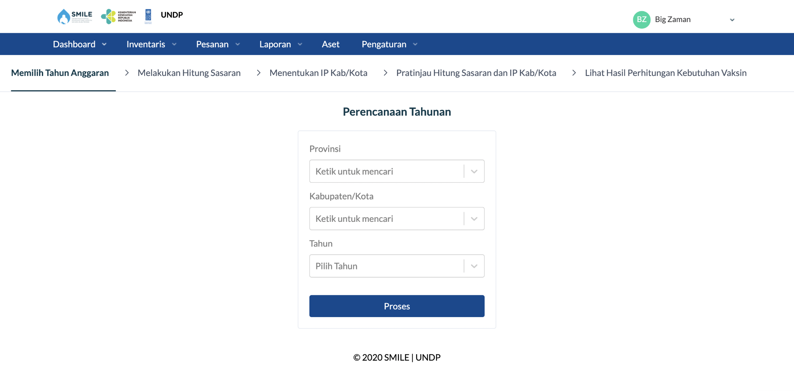

The District/City Health Office uses the Annual Planning function to calculate vaccination requirements and routine immunization logistics for one year. Typically, this calculation is performed toward the end of the year (2021) for the requirements of the following year (2022).

Calculation of vaccine needs & logistics is measured from the number of vaccination targets consisting of live births, surviving infants, infants under two years of age, 1, 2, 5, and 6-grade students, and women of childbearing age (including pregnant women) multiplied by the number administration of each vaccine, then divided by the index of the use of each vaccine.
   
.. code-block:: console

   Number of Needs
   =(Number of Targets * Number of Vaccination Administration) / (Index of Vaccine Use)
   

The Annual Planning for the next vaccine distribution including:
-	Configuration management
-	Conversion table
-	Create forecast bottom up
-	List, detail publish, adjust, delete forecast
-	Realization management