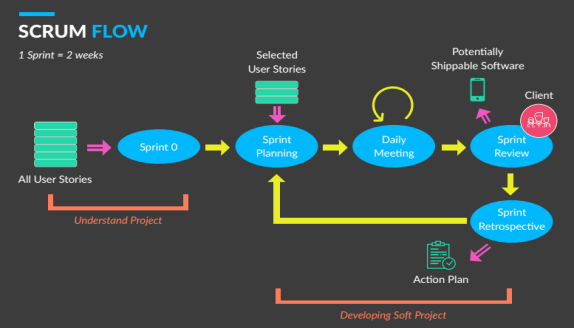

Development Methodology
=====

SMILE is developed using Agile Methodology. Agile methodology is a process framework within which people can address complex adaptive problems while productively and creatively delivering products of the highest possible value. The value given by scrum methodology is courage, focus, commitment, respect and openness. 

With the following details below:
1.	Courage - people in team should have the courage to do the right thing and work on tough problem
2.	Focus - We will develop the application with a focused and targeted for every need that are available
3.	Commitment - people in team commit to achieving the goals
4.	Respect - peoples in team respect each other to be capable, independent people
5.	Openness - people in the team and its stakeholders agree to be open about all the work and the challenges with performing the work.

Beside the value, there are some flowing processes that include in Scrum methodology used by developing this application:

1. Detailing client’s requirement by using user story
2. Sprint Zero
3. Sprint Planning
4. Daily Meeting (every day)
5. Sprint Review (every two weeks we have a meeting with client)
6. Sprint Retrospective

Development is developed iteratively in sprints with the final result of development every two weeks. Both the developer and the UNDP project team collaborate to build a Product Backlog that continues to develop in accordance with the ongoing operations as requested by the ministry of health.

In the very beginning, agile development was started by Sprint 0 as a groundwork event. All requirements to be worked on will be validated (re-fixed) by the development team along with clients, goals and key stakeholders. All of these requirements have been detailed by the development team with the user story. All teams will determine the strategy to reach the vision, mission, goals and details of work (user story) of the product in the form of a project backlog. 
The following are some of the deliverables found in the product backlog, such as:
1.	Product statement (vision, mission) and goals,
2.	Technical solution and outline,
3. Design and experience concept,
4. Defined and estimated product backlog item (user story).  

After knowing about vision, mission and goal, we can see what things that will be worked on and also how many sprints that are needed for developing the system with the form of project backlog. So, we can say the next step is sprint planning.
 
In every sprint, there is a daily meeting in the development team internally. The purpose is to ensure that every work done is right based on the information contained in the project backlog. At a daily meeting, it usually takes 15-30 minutes to discuss what things have been done, what are the problems, how is the solution and what will be done for the next day. This is where the value of Scrum applies, namely focus, which is where we only focus on the work done on the existing sprint.
 
In the scrum process after the team has worked on the project backlog. The development team will check with the client about the work that they are doing whether it is in accordance with their expectations or not. In this section, it is called Sprint Review. This Sprint Review is done to review the progress with the client every 2 weeks.
 
In the sprint review process, if there is feedback, it can be submitted to the development team so that they can correct the errors found on the system. The development team will convey the error later in the next sprint along with the things that are done on the sprint. In this section the value found in the scrum methodology is openness.

