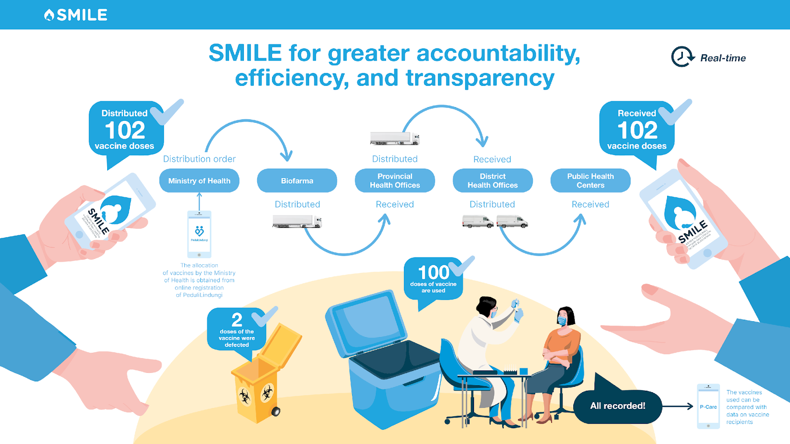

What Does SMILE Do?
=====

This application’s digital innovation includes a mobile application for the cold chain handlers, a web interface into which the app feeds data, a temperature logger that tracks vaccine storage temperatures, and a vaccine and cold chain manager who ensures that the product and procedures run smoothly. Health officials may verify if vaccinations are overstocked, falling short of the prescribed amounts, or totally stocked out using the analytics on the SMILE web interface, facilitating governance and program management by making data available from even the most remote sites.

SMILE improves operational efficiencies, reduces costs for government health providers, and tackles vaccine coverage disparities. It combines cutting-edge technology, systematic record-keeping practices, and a network of trained personnel to assist health officials in addressing widespread inequities in vaccine coverage by overcoming infrastructure, monitoring and management information systems, and human resource constraints, which frequently result in vaccine overstocking and stock-outs in storage facilities. It facilitates evidence-based public health decisions by making data freely available to policy and decision-makers.
