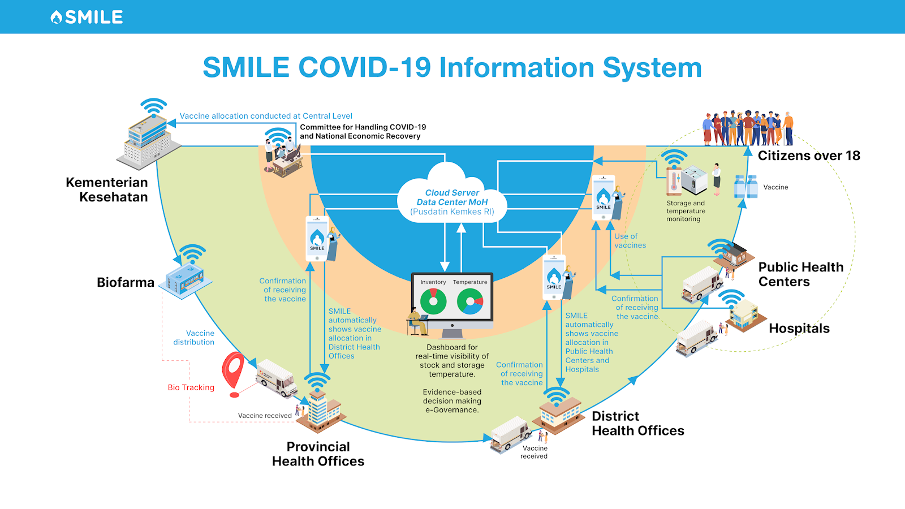

What is SMILE? 
=====

Indonesia, the country with the 4th largest population in the world, has a birth cohort of about 5 million per year. Therefore, the need for equal distribution of vaccines is a priority for public health protection. With a population of more than 270 million people, the distribution of vaccines is not easy. Moreover, geographic conditions with hundreds of thousands of islands in Indonesia, cold chain management, and the complexity of the health information system make logistics distribution a challenge for vaccine distribution in Indonesia.

The Ministry of Health, supported by UNDP, has developed an information system to support effective, efficient, and targeted vaccine distribution called SMILE: "Sistem Monitoring Imunisasi Logistik secara Elektronik". A supply chain and logistics management system, based on mobile apps and web-based, that provides all the information needed related to vaccine stock, in terms of quantity, quality, and storage temperature, as well as the real-time location where the vaccine stock is located. Quality monitoring is carried out through the integration of IoT with devices placed in the refrigerator where the vaccine is stored. SMILE is also used for vaccine distribution for the COVID-19 pandemic.

SMILE is an innovative technology solution to strengthen the immunization vaccine supply chain system in Indonesia. It ensures that safe and effective vaccines are available to all children, wherever and whenever they are. The goal is to implement this immunization vaccine supply chain system across all 34 provinces in Indonesia, strengthening the public health system and acting as a catalyst to achieve the health-related targets of the 2030 Agenda for Sustainable Development, which is good health and well-being for all at all ages. 

SMILE can provide real-time information on all vaccine stocks, along with actual storage temperatures. This real-time data can be viewed on a web- or application-based dashboard by program managers at the district, province, and national levels. All vaccine stocks are digitized by trained cold chain handlers through a smartphone application, and the data is uploaded to a cloud server.

SMILE is developed by local developers under the requirements, supervision, and management of the SMILE UNDP Project. There are three major features of SMILE:

1. SMILE Mobile Inventory: It is used to view the amount of vaccine stock, report out vaccines, report damaged or expired vaccines, send and receive vaccine orders, and monitor vaccine storage.
2. SMILE Website Dashboard: This dashboard is implemented for data visualization of vaccine distribution throughout Indonesia, explained with details of existing vaccine conditions.
3. SMILE Mobile Dashboard: The function of this feature is to view vaccine distribution data and storage device data, and to monitor vaccine temperatures throughout Indonesia via mobile devices.

SMILE is available in Bahasa (the main language) and supports bilinguals (in English). Application development software and supporting software using open-source software. The source code of Smile and its releases are owned by UNDP, as is the intellectual property.

.. note::

   This project is under active development so it may be unstable.
